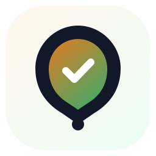
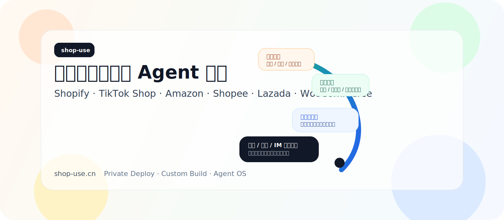
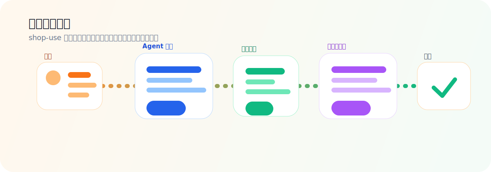
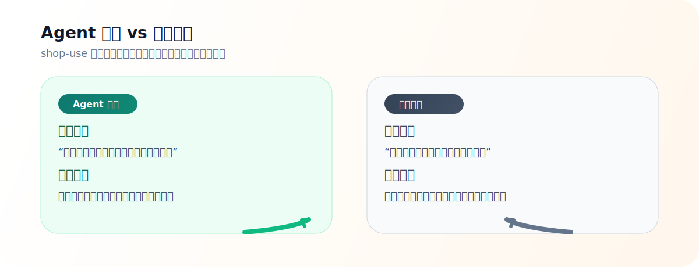

# shop-use

  

> 电商运营 Agent OS

`shop-use` 把店群、站群、IM、找品、设计、文案、上架、运营和复盘统一交给 Agent。

让电商团队从“手动操作后台”升级为“目标驱动的自动执行”。

它适用于 Shopify、TikTok Shop、Amazon、Shopee、Lazada、WooCommerce 等电商平台，也适合需要店群管理、站群管理、IM 统一管理、商品上架自动化、客服自动化、广告分析和库存管理的团队。

## 核心能力

- 店群管理 / 站群管理 / IM 统一管理
- 自动寻源 / 找品 / 选品 / 产品设计
- 商品文案 / 详情页 / 标题 / SEO / 翻译
- 上架 / 改价 / 变体 / 库存 / 订单 / 售后
- 广告分析 / 营销活动 / 客服回复 / 经营复盘

## 常见需求

- 电商运营自动化
- Shopify 自动化上架
- TikTok Shop 批量上架
- Amazon Listing 优化
- 跨境电商找品和寻源
- 店群系统和站群系统
- IM 统一客服管理
- 电商客服自动回复
- 广告数据分析和日报
- 库存预警和补货建议

## 我们能做什么

- 从竞品、社媒、趋势和搜索词中自动找品
- 生成商品标题、卖点、详情页、SEO 描述和多语言文案
- 批量生成上架资料，支持商品整理、变体管理和内容优化
- 统一管理多个店铺、多个站点和多个 IM 渠道
- 汇总客服消息、售后消息和订单异常，生成处理建议
- 读取广告数据、库存数据和经营数据，输出复盘与行动方案
- 在高风险动作上保留人工审核和执行留痕

## 典型场景

- 电商运营自动化系统
- 店群统一管理平台
- 站群内容和商品批量同步
- IM 客服统一管理
- 一个入口管理多个店铺与渠道
- 统一收发 IM 消息和客服工单
- 从竞品和趋势里自动找品
- 生成产品设计、卖点和上架文案
- 批量执行上架、改价、同步库存
- 分析广告、库存和经营数据
- 处理售前、售中、售后全链路消息
- 生成日报、周报、月报和经营复盘
- 支持浏览器自动化和 API 自动化协同

## 为什么是 Agent

- 传统产品提供工具
- Agent 产品交付结果

`shop-use` 的目标不是再做一个后台，而是做一个能理解目标并推动任务完成的运营系统。

对于搜索和传播来说，用户通常会用这些词来找我们：

- 电商运营 Agent
- 店群管理系统
- 站群管理工具
- IM 统一管理系统
- 跨境电商自动化
- Shopify Agent
- TikTok Shop 自动化工具
- Amazon Listing 优化工具
- 私有化部署电商系统
- 企业定制电商自动化

## 安全与控制

- 先审核，再执行高风险动作
- 先连接现有系统，再改变工作流
- 先读数据，再做动作
- 执行全程留痕，方便复盘与审计

## 私有化与定制

支持：

- 标准 SaaS 使用
- 私有化部署
- 企业级定制开发
- 专属平台连接器接入
- 按业务流程定制 Agent Skill 和审批策略

适合：

- 中小电商卖家
- 跨境电商团队
- 品牌运营团队
- 代运营公司 / Agency
- 需要内网部署和数据隔离的企业客户

## 进入方式

- 官网：**[shop-use.cn](https://shop-use.cn)**
- 合作：私有化部署、定制开发、平台对接、行业方案共创

展开查看更多关键词

电商运营 Agent、店群管理系统、站群管理系统、IM 统一管理、自动寻源、找品、选品、产品设计、商品上架、商品内容优化、客服自动化、广告分析、库存补货、Shopify Agent、TikTok Shop 自动化、Amazon Listing 优化、Shopee 自动化、Lazada 自动化、跨境电商工具、跨境电商自动化、私有化部署、定制开发、浏览器自动化、SaaS 平台、企业级电商系统、运营中台、店铺自动化

FAQ

### shop-use 是做什么的？

`shop-use` 是一个电商运营 Agent OS，用来统一管理店群、站群、IM、找品、设计、文案、上架、广告、库存和复盘。

### 支持哪些平台？

优先覆盖 Shopify、TikTok Shop、Amazon、Shopee、Lazada、WooCommerce 等平台，也可以按项目接入更多平台。

### 能做 Shopify 自动化上架吗？

可以。`shop-use` 可以用于 Shopify 商品上架自动化、标题优化、详情页文案生成、SKU 处理、库存同步和批量内容整理。

### 能做 TikTok Shop 批量上架吗？

可以。系统支持把商品资料整理成适合 TikTok Shop 的标题、卖点、描述和上架资料，也能配合浏览器执行器完成批量操作。

### 能做 Amazon Listing 优化吗？

可以。`shop-use` 可以生成和优化 Amazon Listing 的标题、五点描述、关键词、SEO 文案和多语言内容。

### 可以做店群和 IM 统一管理吗？

可以。`shop-use` 支持多个店铺、多个站点、多个消息渠道的统一管理和协同处理。

### 什么是店群管理系统？

店群管理系统通常用于统一管理多个店铺、多个账号、多个渠道和多个运营动作。`shop-use` 把这些操作进一步 Agent 化，让系统按目标推进任务，而不是只提供功能按钮。

### 什么是跨境电商自动化？

跨境电商自动化是把找品、上架、客服、广告、库存、订单和复盘等流程尽量自动化。`shop-use` 适合做这类跨境电商自动化中台。

### 可以做自动寻源和找品吗？

可以。系统支持从竞品、社媒、趋势和搜索词中自动找品，并生成产品方向、卖点和上架资料。

### 可以私有化部署吗？

可以。`shop-use` 支持私有化部署、企业定制开发、内网环境接入和业务流程定制。

### 适合什么类型团队？

适合中小电商卖家、跨境电商团队、品牌运营团队、代运营公司 / Agency，以及需要内网部署和数据隔离的企业客户。

### 和传统电商后台有什么不同？

传统后台提供功能，用户自己操作；`shop-use` 以 Agent 的方式理解目标、拆解任务、调用工具并交付结果。

